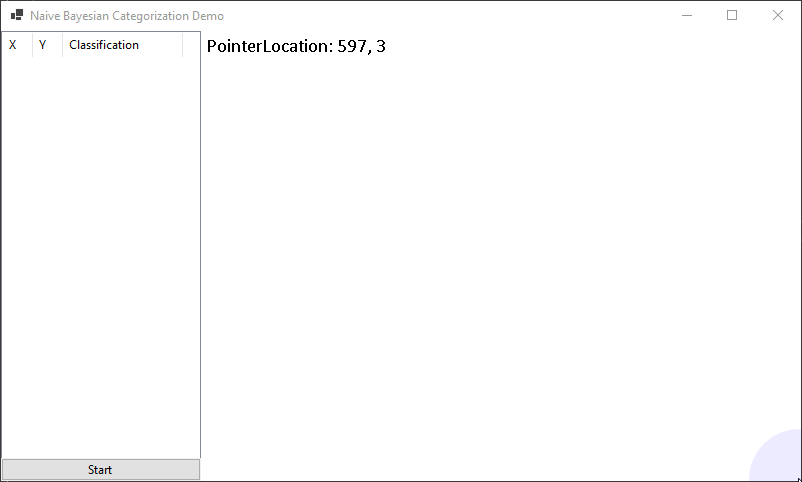

# An experimental demo of naive bayesian categorization

This code demonstrates an implementation of classification of observations.
The code is not best effort at all, just an experiment with no tests and no fancy patterns.

## How to use
Build in Visual Studio 2022.

Run

Mouse buttons:
- Click/Hold Left to place one observation and have it classified.
- Hold SHIFT and press mouse buttons:
  - Left, to classify as Foo
  - Right, to classify as Bar
  - Middle, to classify as None (delete classification)

Keys:
- Space, start/stop spraying ovservations over the graph.
- Escape, delete all observations

Example:

